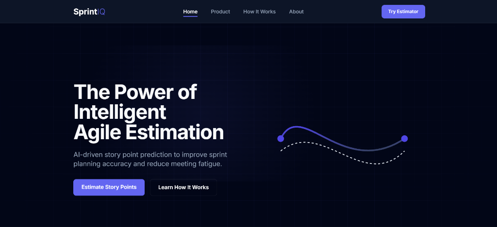
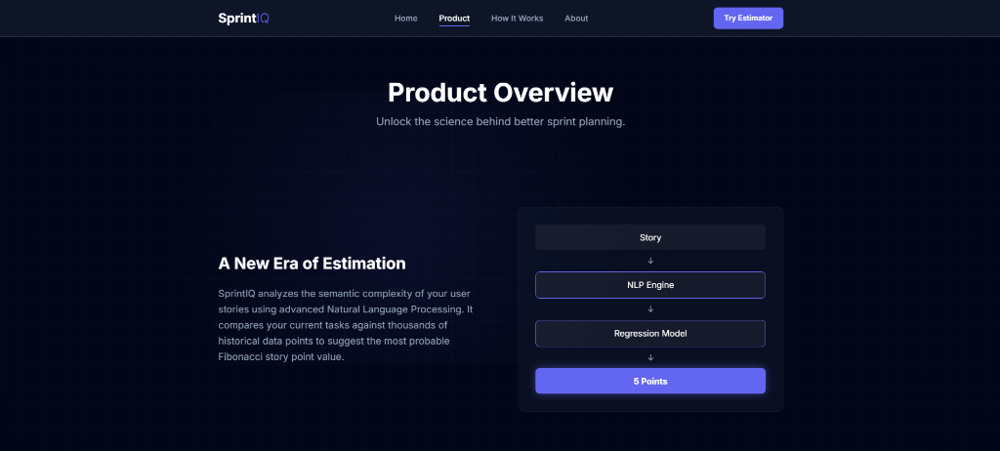
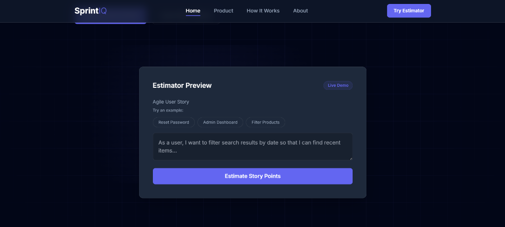
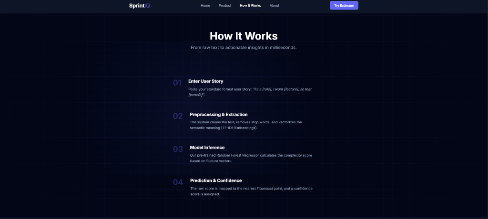
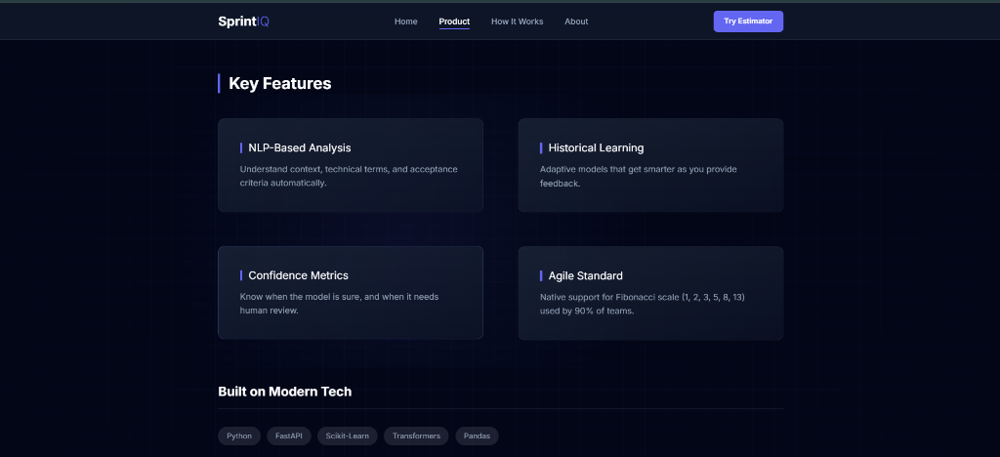
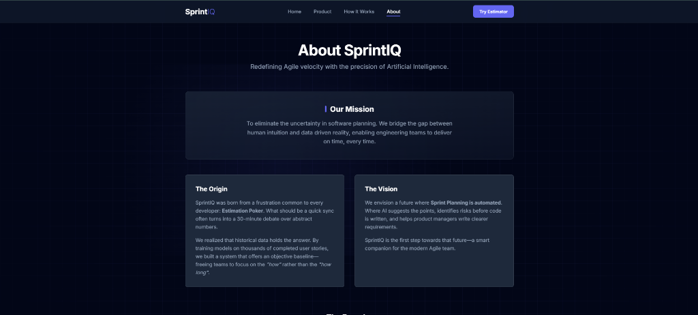

<div align="center">

# ⚡ SprintIQ

### Intelligent Agile Story Point Estimation System

**AI-powered story point prediction using NLP and Machine Learning**

[](https://sprintiq-intq.onrender.com)
[](https://python.org)
[](https://fastapi.tiangolo.com)
[](https://scikit-learn.org)

</div>

---

## 📌 About The Project

SprintIQ is an advanced machine learning-based estimation system that optimizes Agile sprint planning. By leveraging **Natural Language Processing (NLP)** and historical project data, it analyzes the semantic complexity of user stories to deliver **objective, data-driven story point estimates** — eliminating subjective bias and reducing sprint planning time.

<div align="center">



</div>

## 🎯 Problem Statement

Accurate estimation is critical for predictable delivery in modern software engineering. Traditional Planning Poker and team-based estimation suffer from:
- **Anchoring bias** — estimates influenced by the first number suggested
- **Inconsistency** — same story, different estimates across teams
- **Time waste** — hours spent debating story points in meetings

**SprintIQ solves this** by providing a neutral, ML-powered baseline that teams can use as a starting point.

## ✨ Key Features

| Feature | Description |
|---|---|
| 🧠 **AI-Powered Estimation** | Random Forest Regressor trained on historical agile data with TF-IDF vectorization |
| ⚖️ **Bias Reduction** | Algorithmic second opinion eliminates anchoring and groupthink effects |
| ⚡ **Instant Predictions** | Real-time estimates via web UI or REST API |
| 📊 **Confidence Scoring** | Each prediction includes a confidence metric (High/Medium/Low) |
| 🔄 **Feedback Loop** | Users can correct estimates to continuously improve the model |
| 🎯 **Fibonacci Scale** | Maps predictions to standard Agile scale (1, 2, 3, 5, 8, 13) |

## 🏗️ System Architecture

```
┌─────────────────────────────────────────────────────────────┐
│                        SprintIQ Pipeline                     │
├──────────┬──────────────┬────────────────┬──────────────────┤
│  INPUT   │ PREPROCESSING│   ML ENGINE    │    OUTPUT         │
│          │              │                │                   │
│ User     │ Tokenization │ TF-IDF         │ Story Points      │
│ Story    │ Stop-word    │ Vectorization  │ (Fibonacci)       │
│ Text     │ Removal      │ Random Forest  │ Confidence Score  │
│          │ Cleaning     │ Regression     │                   │
└──────────┴──────────────┴────────────────┴──────────────────┘
```

<div align="center">



</div>

## 🖥️ Screenshots

<div align="center">

| Estimator UI | How It Works |
|---|---|
|  |  |

| Features Overview | About & Mission |
|---|---|
|  |  |

</div>

## 🛠️ Technology Stack

| Layer | Technology |
|---|---|
| **Backend** | FastAPI (Python) |
| **ML Model** | Scikit-Learn (Random Forest Regressor) |
| **NLP** | TF-IDF Vectorization |
| **Data Processing** | Pandas, NumPy |
| **Frontend** | Jinja2 Templates, Tailwind CSS |
| **Server** | Uvicorn (ASGI) |
| **Deployment** | Render |

## 🚀 Quick Start

### Prerequisites
- Python 3.9+
- pip

### Installation

```bash
# Clone the repository
git clone https://github.com/vivekperka7-spec/Agile-Story-Point-Estimation-using-Machine-Learning-.git
cd Agile-Story-Point-Estimation-using-Machine-Learning-

# Install dependencies
pip install -r requirements.txt

# Train the model
python scripts/train_model.py

# Start the application
uvicorn main:app --reload
```

The application will be accessible at `http://127.0.0.1:8000`

## 📡 API Reference

### Predict Story Points

```http
POST /predict
Content-Type: application/json
```

**Request Body:**
```json
{
  "user_story": "As a user, I want to filter search results by price range so that I can find affordable items."
}
```

**Response:**
```json
{
  "predicted_story_points": 3,
  "confidence": "high"
}
```

## 🔗 Live Demo

🌐 **Try it live:** [https://sprintiq-intq.onrender.com](https://sprintiq-intq.onrender.com)

> **Note:** The app is hosted on Render's free tier. It may take ~30 seconds to wake up on the first visit.

## 👨‍💻 Author

**Vivek Perka**

> *"SprintIQ demonstrates the power of Machine Learning in modern software engineering, aiming to resolve real-world Agile challenges like estimation bias through data-driven insights."*

## 📄 License

**Copyright © 2026 Vivek Perka. All Rights Reserved.**

This project, including its source code and proprietary estimation algorithms, is the intellectual property of P.Vivek. Unauthorized reproduction, distribution, or commercial use of the core logic without explicit permission is strictly prohibited.
